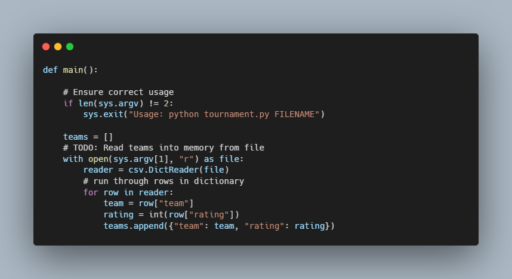

# Fifa World Cup - CS50

### Description

A program to run simulations of the Fifa World Cup.

In FIFA’s World Cup, the knockout round consists of 16 teams. In each round, each team plays another team and the losing teams are eliminated. When only two teams remain, the winner of the final match is the champion.

In football, teams are given FIFA Ratings, which are numerical values representing each team’s relative skill level. Higher FIFA ratings indicate better previous game results, and given two teams’ FIFA ratings, it’s possible to estimate the probability that either team wins a game based on their current ratings. The FIFA Ratings from two previous World Cups are available as the May 2018 Men’s FIFA Ratings and March 2019 Women’s FIFA Ratings.

Using this information, we can simulate the entire tournament by repeatedly simulating rounds until we’re left with just one team. And if we want to estimate how likely it is that any given team wins the tournament, we might simulate the tournament many times (e.g. 1000 simulations) and count how many times each team wins a simulated tournament.

### How to use

python tournament.py 2018.csv

### Code Snippet

### Links

For more information about Filter-more visit: 

---------------------------------
[cs50 course](https://cs50.harvard.edu/x/2022/labs/6/)
---------------------------------------------------------------

